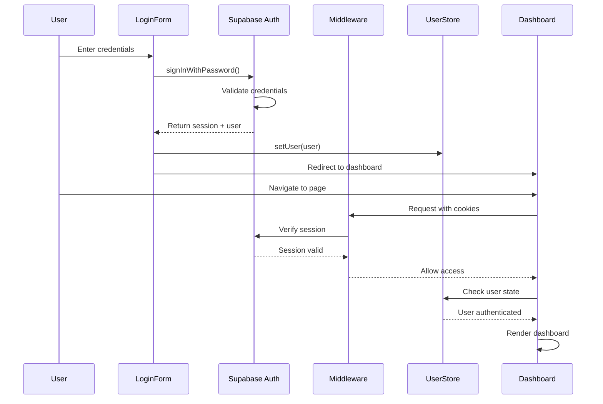
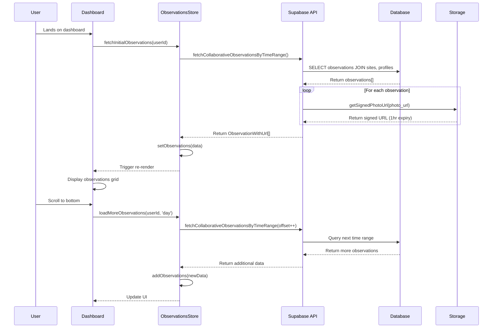
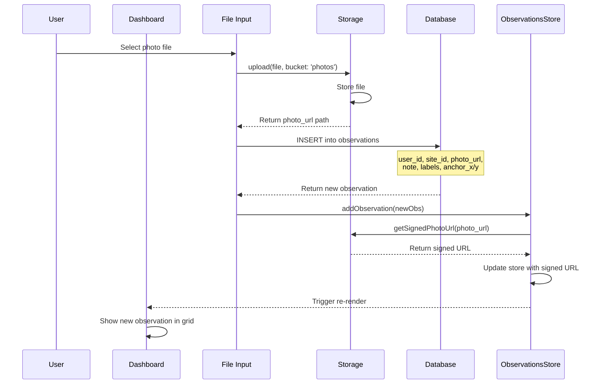
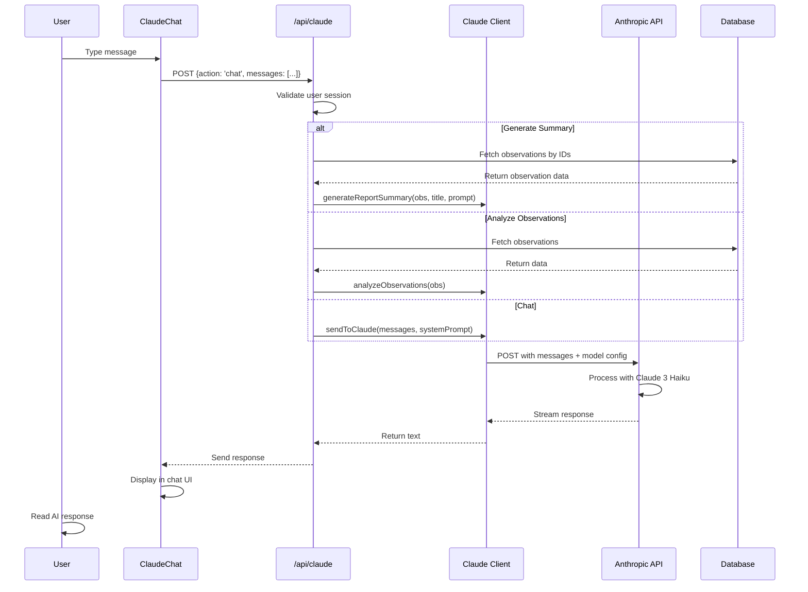
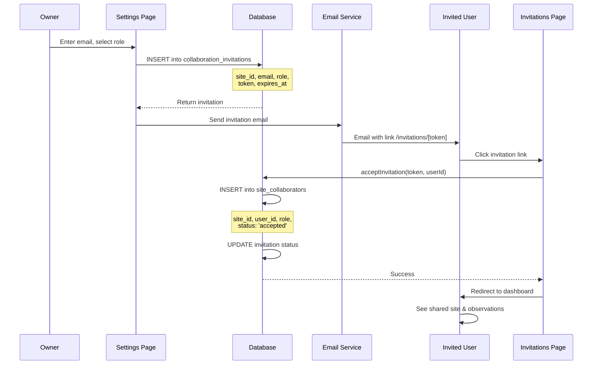
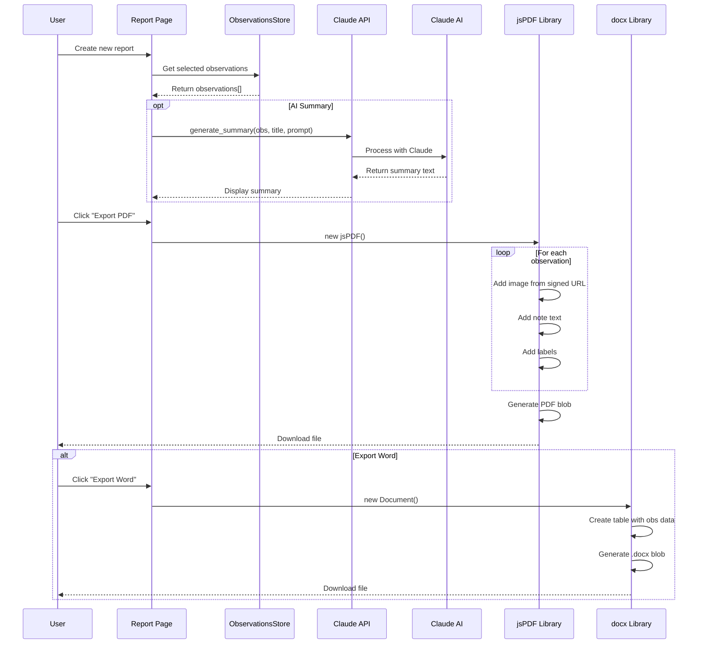
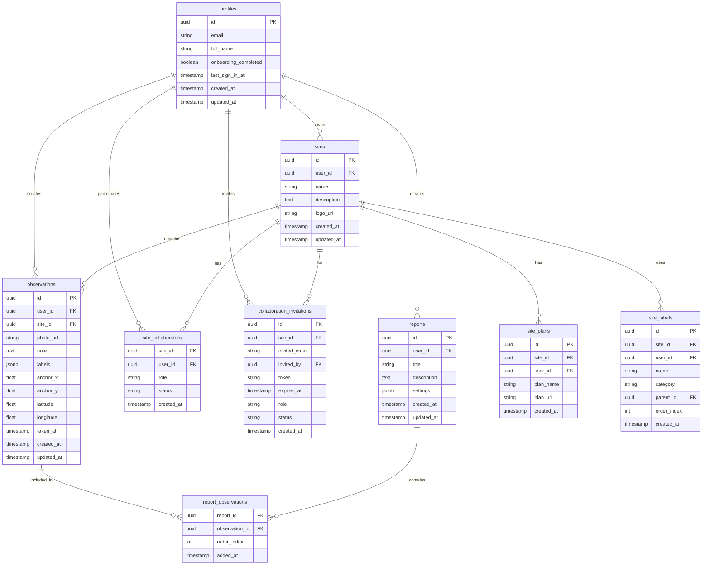

# Site Web App - Comprehensive Architecture Diagram

## 🏗️ Overall System Architecture

```mermaid
graph TB
    subgraph "Client Layer - Browser"
        User[👤 User]
        Browser[🌐 Browser]
        NextJS[Next.js 15 App Router]

        subgraph "Pages - App Router"
            Dashboard[📊 Dashboard<br/>/app/page.tsx]
            Settings[⚙️ Settings<br/>/app/settings]
            Reports[📄 Reports<br/>/app/reports]
            Auth[🔐 Auth Pages<br/>/app/auth/*]
            Shared[🔗 Shared Reports<br/>/app/shared/[id]]
        end

        subgraph "React Components"
            PhotoModal[🖼️ PhotoModal]
            ClaudeChat[🤖 ClaudeChat]
            PlanWidget[📐 PlanWidget]
            LoginForm[📝 LoginForm]
            SignUpForm[📝 SignUpForm]
        end

        subgraph "State Management - Zustand"
            ObsStore[📦 ObservationsStore<br/>388 lines]
            UserStore[👤 UserStore]
            PlanStore[📐 PlanStore]
        end
    end

    subgraph "API Layer - Next.js Routes"
        ClaudeAPI[🤖 /api/claude]
        ObsAPI[📸 /api/observations]
        AuthConfirm[✅ /auth/confirm]
    end

    subgraph "Middleware Layer"
        Middleware[🛡️ middleware.ts<br/>Session Validation]
        SupabaseMiddleware[🔒 Supabase Middleware<br/>Auth Check]
    end

    subgraph "Backend Services"
        subgraph "Supabase"
            SupabaseAuth[🔐 Supabase Auth<br/>OAuth + Password]
            SupabaseDB[(🗄️ PostgreSQL Database)]
            SupabaseStorage[💾 Storage<br/>Photos Bucket]
        end

        subgraph "AI Services"
            Claude[🧠 Claude AI<br/>Anthropic API]
        end
    end

    subgraph "Database Tables"
        Observations[(observations)]
        Profiles[(profiles)]
        Sites[(sites)]
        Collaborators[(site_collaborators)]
        Invitations[(collaboration_invitations)]
        Plans[(site_plans)]
        Labels[(site_labels)]
        ReportsTable[(reports)]
        ReportObs[(report_observations)]
    end

    User --> Browser
    Browser --> NextJS
    NextJS --> Middleware
    Middleware --> SupabaseMiddleware

    NextJS --> Dashboard
    NextJS --> Settings
    NextJS --> Reports
    NextJS --> Auth
    NextJS --> Shared

    Dashboard --> PhotoModal
    Dashboard --> ClaudeChat
    Dashboard --> PlanWidget
    Auth --> LoginForm
    Auth --> SignUpForm

    Dashboard --> ObsStore
    Settings --> ObsStore
    Reports --> ObsStore
    Auth --> UserStore
    PlanWidget --> PlanStore

    ObsStore --> ClaudeAPI
    ObsStore --> ObsAPI
    ClaudeChat --> ClaudeAPI
    LoginForm --> SupabaseAuth
    SignUpForm --> SupabaseAuth

    ClaudeAPI --> Claude
    ObsAPI --> SupabaseDB
    SupabaseAuth --> SupabaseDB

    SupabaseDB --> Observations
    SupabaseDB --> Profiles
    SupabaseDB --> Sites
    SupabaseDB --> Collaborators
    SupabaseDB --> Invitations
    SupabaseDB --> Plans
    SupabaseDB --> Labels
    SupabaseDB --> ReportsTable
    SupabaseDB --> ReportObs

    PhotoModal --> SupabaseStorage
    ObsStore --> SupabaseStorage
```

---

## 🔄 Data Flow Diagrams

### 1. Authentication Flow



### 2. Observations Loading Flow



### 3. Photo Upload & Observation Creation



### 4. Claude AI Integration Flow



### 5. Collaboration & Invitation Flow



### 6. Report Generation Flow



---

## 📦 Component Hierarchy

```
App Layout (Root)
│
├── Providers
│   ├── ThemeProvider (next-themes)
│   └── Zustand Stores Context
│
└── Pages
    │
    ├── 🏠 Dashboard (/app/page.tsx) - 1918 lines
    │   ├── Navigation Bar
    │   │   ├── Logo
    │   │   ├── Search Input
    │   │   ├── Filter Controls
    │   │   │   ├── Site Filter Dropdown
    │   │   │   ├── Label Filter Dropdown
    │   │   │   └── Date Range Picker
    │   │   ├── AuthButtonClient
    │   │   │   └── User Avatar + Dropdown Menu
    │   │   └── ThemeSwitcher (light/dark toggle)
    │   │
    │   ├── Main Content Area
    │   │   ├── Statistics Banner
    │   │   │   ├── Total Observations Count
    │   │   │   ├── Sites Count
    │   │   │   └── Labels Count
    │   │   │
    │   │   ├── Observations Grid (responsive columns)
    │   │   │   └── ObservationCard[] (for each observation)
    │   │   │       ├── Next/Image (thumbnail)
    │   │   │       ├── Note Preview (truncated)
    │   │   │       ├── Labels (Badge components)
    │   │   │       ├── Site Name
    │   │   │       ├── Date/Time
    │   │   │       └── Click Handler → Open PhotoModal
    │   │   │
    │   │   └── Load More Button
    │   │       └── onClick → loadMoreObservations()
    │   │
    │   ├── PhotoModal (conditional render)
    │   │   ├── Modal Overlay (dim background)
    │   │   ├── Modal Content
    │   │   │   ├── Header
    │   │   │   │   ├── Close Button
    │   │   │   │   └── Share Button
    │   │   │   │
    │   │   │   ├── Image Display Area
    │   │   │   │   ├── Full-size Image (Next/Image)
    │   │   │   │   ├── Navigation Arrows (prev/next)
    │   │   │   │   └── Zoom Controls
    │   │   │   │
    │   │   │   └── Metadata Panel
    │   │   │       ├── Note Editor (Textarea)
    │   │   │       ├── Label Selector (Multi-select)
    │   │   │       ├── Site Selector (Dropdown)
    │   │   │       ├── Anchor Position Display
    │   │   │       │   ├── X Coordinate
    │   │   │       │   └── Y Coordinate
    │   │   │       ├── GPS Coordinates
    │   │   │       │   ├── Latitude
    │   │   │       │   └── Longitude
    │   │   │       ├── Timestamps
    │   │   │       │   ├── Created At
    │   │   │       │   ├── Updated At
    │   │   │       │   └── Taken At
    │   │   │       └── Save/Delete Buttons
    │   │   │
    │   │   └── Event Handlers
    │   │       ├── onSave → updateObservation()
    │   │       ├── onDelete → deleteObservation()
    │   │       └── onClose → closeModal()
    │   │
    │   ├── ClaudeChat (floating widget)
    │   │   ├── Chat Header
    │   │   │   ├── Claude Icon
    │   │   │   ├── Title
    │   │   │   └── Minimize/Close Buttons
    │   │   │
    │   │   ├── Messages Container (scrollable)
    │   │   │   └── Message[] (user/assistant)
    │   │   │       ├── Avatar
    │   │   │       ├── Message Text (markdown)
    │   │   │       └── Timestamp
    │   │   │
    │   │   └── Input Form
    │   │       ├── Textarea (auto-resize)
    │   │       ├── Send Button
    │   │       └── onSubmit → sendToClaude()
    │   │
    │   └── Sidebar (collapsible)
    │       ├── UserManualCarousel
    │       │   ├── Carousel Controls (prev/next)
    │       │   └── Image Slides[]
    │       │
    │       ├── PlanWidget
    │       │   ├── Plan Canvas (zoomable/pannable)
    │       │   │   ├── Background Image (construction plan)
    │       │   │   ├── Anchor Markers (observations)
    │       │   │   └── Zoom Controls (+/-)
    │       │   │
    │       │   └── Event Handlers
    │       │       ├── onPan → setPlanPosition()
    │       │       ├── onZoom → setZoomScale()
    │       │       └── onClick → setAnchor()
    │       │
    │       └── Statistics Widget
    │           ├── Charts/Graphs
    │           └── Summary Data
    │
    ├── ⚙️ Settings Page (/app/settings/page.tsx)
    │   ├── Tabs Navigation
    │   │   ├── Sites Tab
    │   │   ├── Collaborators Tab
    │   │   ├── Labels Tab
    │   │   └── User Settings Tab
    │   │
    │   ├── Sites Management
    │   │   ├── Site List
    │   │   │   └── SiteCard[]
    │   │   │       ├── Site Logo (Image)
    │   │   │       ├── Site Name
    │   │   │       ├── Description
    │   │   │       ├── Edit Button
    │   │   │       └── Delete Button
    │   │   │
    │   │   └── Create Site Form
    │   │       ├── Name Input
    │   │       ├── Description Textarea
    │   │       ├── Logo Upload
    │   │       └── Submit Button
    │   │
    │   ├── Collaborators Management
    │   │   ├── Invite Form
    │   │   │   ├── Email Input
    │   │   │   ├── Role Select (owner/admin/collaborator)
    │   │   │   └── Send Invite Button
    │   │   │
    │   │   ├── Pending Invitations List
    │   │   │   └── InvitationCard[]
    │   │   │       ├── Email
    │   │   │       ├── Role Badge
    │   │   │       ├── Expiry Date
    │   │   │       └── Cancel Button
    │   │   │
    │   │   └── Active Collaborators List
    │   │       └── CollaboratorCard[]
    │   │           ├── User Avatar
    │   │           ├── Name/Email
    │   │           ├── Role Badge
    │   │           ├── Edit Role Button
    │   │           └── Remove Button
    │   │
    │   ├── Labels Management
    │   │   ├── Category Tabs
    │   │   │   ├── Location Labels
    │   │   │   ├── Gewerk Labels (trades)
    │   │   │   └── Type Labels
    │   │   │
    │   │   ├── Label Tree (hierarchical)
    │   │   │   └── LabelNode[]
    │   │   │       ├── Label Name
    │   │   │       ├── Parent Indicator
    │   │   │       ├── Drag Handle (reorder)
    │   │   │       ├── Edit Button
    │   │   │       ├── Delete Button
    │   │   │       └── Children[] (nested)
    │   │   │
    │   │   └── Create Label Form
    │   │       ├── Name Input
    │   │       ├── Category Select
    │   │       ├── Parent Select (optional)
    │   │       └── Submit Button
    │   │
    │   └── User Settings
    │       ├── Language Selector
    │       ├── Profile Info
    │       │   ├── Name Input
    │       │   ├── Email (readonly)
    │       │   └── Update Button
    │       └── Password Change
    │           ├── Current Password Input
    │           ├── New Password Input
    │           ├── Confirm Password Input
    │           └── Update Password Button
    │
    ├── 📄 Reports Page (/app/reports/page.tsx)
    │   ├── Reports List
    │   │   ├── Search Input
    │   │   ├── Filter Controls
    │   │   └── ReportCard[]
    │   │       ├── Report Title
    │   │       ├── Description
    │   │       ├── Observation Count
    │   │       ├── Created Date
    │   │       ├── View Button
    │   │       ├── Edit Button
    │   │       ├── Share Button
    │   │       └── Delete Button
    │   │
    │   └── Create Report Button
    │       └── onClick → Navigate to /report
    │
    ├── 📝 Report Detail (/app/reports/[id]/page.tsx)
    │   ├── Report Header
    │   │   ├── Title Editor
    │   │   ├── Description Editor
    │   │   └── Action Buttons
    │   │       ├── Save Button
    │   │       ├── Share Button
    │   │       └── Delete Button
    │   │
    │   ├── Observations Section
    │   │   ├── Add Observations Button
    │   │   │   └── Opens Observation Selector Modal
    │   │   │
    │   │   └── Included Observations Grid
    │   │       └── ObservationCard[] (with remove button)
    │   │
    │   ├── AI Assistant Panel
    │   │   ├── ClaudeReportAssistant
    │   │   │   ├── "Generate Summary" Button
    │   │   │   ├── Custom Prompt Input
    │   │   │   └── Summary Display Area
    │   │   │
    │   │   └── Loading State / Error Handling
    │   │
    │   └── Export Section
    │       ├── Export to PDF Button
    │       │   └── onClick → generatePDF()
    │       ├── Export to Word Button
    │       │   └── onClick → generateWord()
    │       └── Export Options
    │           ├── Include Photos Checkbox
    │           ├── Include Notes Checkbox
    │           └── Include Labels Checkbox
    │
    ├── 🔐 Auth Pages (/app/auth/*)
    │   ├── Login Page (/auth/login)
    │   │   ├── LoginForm
    │   │   │   ├── Email Input
    │   │   │   ├── Password Input
    │   │   │   ├── Remember Me Checkbox
    │   │   │   ├── Login Button
    │   │   │   ├── Forgot Password Link
    │   │   │   └── Sign Up Link
    │   │   │
    │   │   └── OAuth Buttons
    │   │       ├── Google Login
    │   │       └── GitHub Login
    │   │
    │   ├── Sign Up Page (/auth/sign-up)
    │   │   └── SignUpForm
    │   │       ├── Email Input
    │   │       ├── Password Input
    │   │       ├── Confirm Password Input
    │   │       ├── Full Name Input
    │   │       ├── Terms Checkbox
    │   │       └── Sign Up Button
    │   │
    │   ├── Forgot Password Page (/auth/forgot-password)
    │   │   └── ForgotPasswordForm
    │   │       ├── Email Input
    │   │       └── Send Reset Link Button
    │   │
    │   └── Update Password Page (/auth/update-password)
    │       └── UpdatePasswordForm
    │           ├── New Password Input
    │           ├── Confirm Password Input
    │           └── Update Button
    │
    ├── 🎯 Onboarding Page (/app/onboarding/page.tsx)
    │   ├── Welcome Screen
    │   ├── Site Creation Wizard
    │   │   ├── Step 1: Site Details
    │   │   ├── Step 2: Upload Logo
    │   │   └── Step 3: Create Labels
    │   └── Complete Button
    │
    ├── 📧 Invitations Page (/app/invitations/[token]/page.tsx)
    │   ├── Invitation Details
    │   │   ├── Site Name
    │   │   ├── Invited By
    │   │   ├── Role Badge
    │   │   └── Expiry Warning
    │   │
    │   └── Action Buttons
    │       ├── Accept Button
    │       └── Decline Button
    │
    ├── 🔗 Shared Report Page (/app/shared/[id]/page.tsx)
    │   ├── Public Report View (no auth)
    │   │   ├── Report Title
    │   │   ├── Description
    │   │   ├── Creation Date
    │   │   │
    │   │   └── SharedPhotoViewer
    │   │       ├── Observations Grid (readonly)
    │   │       │   └── ObservationCard[] (no edit)
    │   │       │
    │   │       └── Photo Modal (readonly)
    │   │           ├── Image Display
    │   │           ├── Note Display
    │   │           └── Labels Display
    │   │
    │   └── Sign Up CTA (if not logged in)
    │
    └── 🏗️ Tunnels Page (/app/tunnels/page.tsx)
        ├── Tunnel List
        └── Tunnel Details
```

---

## 🗄️ Database Schema & Relationships



---

## 🔐 Authentication & Authorization Flow

```
┌─────────────────────────────────────────────────────────────┐
│                    Authentication Layers                     │
└─────────────────────────────────────────────────────────────┘

Layer 1: Browser Request
    │
    ├──> [middleware.ts] - Next.js Middleware
    │        │
    │        ├─> Calls updateSession() from Supabase SSR
    │        │       │
    │        │       ├─> Checks session cookie
    │        │       ├─> Validates token with Supabase
    │        │       └─> Refreshes if needed
    │        │
    │        ├─> Public routes whitelist:
    │        │   - /auth/* (all auth pages)
    │        │   - /shared/* (public reports)
    │        │   - /about
    │        │   - /tunnels
    │        │   - /report (public view)
    │        │   - /_next/* (Next.js static)
    │        │   - /api/* (API routes)
    │        │
    │        └─> Protected routes:
    │            - / (dashboard)
    │            - /settings
    │            - /reports/*
    │            - /onboarding
    │            └─> If no session → redirect to /auth/login
    │
    ↓
Layer 2: Page Component (Server/Client)
    │
    ├──> Server Components
    │        └─> createClient() from @/lib/supabase/server
    │            └─> Uses cookies() for session
    │
    └──> Client Components
             └─> createBrowserClient() from @/lib/supabase/client
                 └─> Uses localStorage/cookies for session

Layer 3: Supabase Auth
    │
    ├──> Session Storage: HTTP-only cookies
    ├──> Token Type: JWT (JSON Web Token)
    ├──> Token Refresh: Automatic (middleware handles)
    └──> Auth Methods:
         ├─> Email/Password (signInWithPassword)
         ├─> OAuth (Google, GitHub)
         └─> Magic Link (email confirmation)

Layer 4: Row Level Security (RLS)
    │
    └──> Database Policies (Supabase PostgreSQL)
         │
         ├─> profiles table
         │   └─> Users can only read/update their own profile
         │
         ├─> observations table
         │   ├─> Users can read observations from:
         │   │   - Sites they own
         │   │   - Sites they collaborate on
         │   └─> Users can insert/update/delete only their own
         │
         ├─> sites table
         │   ├─> Users can read sites where:
         │   │   - They are owner
         │   │   - They are collaborator (via site_collaborators)
         │   └─> Only owners can update/delete
         │
         └─> site_collaborators table
             ├─> Users can read where they are involved
             └─> Only site owners can insert/update/delete
```

---

## 📊 State Management Architecture (Zustand)

```
┌──────────────────────────────────────────────────────────────┐
│                    Zustand Store Structure                    │
└──────────────────────────────────────────────────────────────┘

useObservationsStore (lib/store/observations-store.ts)
├── State Properties
│   ├── observations: ObservationWithUrl[]
│   │   └── Observations with temporary signed URLs (1hr expiry)
│   │
│   ├── observationsWithPhotos: ObservationWithPhoto[]
│   │   └── Observations with base64-encoded images
│   │
│   ├── observationDates: string[]
│   │   └── Unique dates for filtering (YYYY-MM-DD)
│   │
│   ├── availableLabels: string[]
│   │   └── All unique labels across observations
│   │
│   ├── siteLabels: Map<siteId, Label[]>
│   │   └── Hierarchical labels per site
│   │
│   ├── isLoading: boolean
│   ├── isLoadingMore: boolean
│   ├── hasMore: boolean (pagination flag)
│   ├── dayOffset: number (for infinite scroll)
│   ├── error: string | null
│   └── currentUserId: string | null
│
└── Actions (Async Functions)
    ├── setObservations(obs: ObservationWithUrl[])
    │   └── Replaces entire observations array
    │
    ├── addObservations(obs: ObservationWithUrl[])
    │   └── Appends to existing observations (pagination)
    │
    ├── fetchInitialObservations(userId: string)
    │   ├─> Calls fetchCollaborativeObservationsByTimeRange()
    │   │   └── Fetches last 3 days of observations
    │   ├─> For each observation, gets signed URL
    │   └─> Updates observations state
    │
    ├── loadMoreObservations(userId: string, type: 'day'|'week'|'month')
    │   ├─> Increments dayOffset
    │   ├─> Fetches next time range
    │   └─> Appends to observations array
    │
    ├── fetchDates(userId: string)
    │   ├─> Queries database for unique dates
    │   └─> Updates observationDates state
    │
    ├── processPhotos(observations: ObservationWithUrl[])
    │   ├─> Downloads each photo via signed URL
    │   ├─> Converts to base64 data URL
    │   └─> Updates observationsWithPhotos state
    │   └─> Used for: PDF/Word export, offline viewing
    │
    ├── fetchSiteLabels(siteId: string, userId: string)
    │   ├─> Queries site_labels table
    │   ├─> Transforms to hierarchical structure
    │   └─> Updates siteLabels Map
    │
    └── clearStore()
        └─> Resets all state to initial values


useUserStore (lib/store/user-store.ts)
├── State Properties
│   ├── user: User | null (Supabase user object)
│   ├── isLoading: boolean
│   └── error: string | null
│
└── Actions
    ├── setUser(user: User | null)
    ├── setLoading(loading: boolean)
    ├── setError(error: string | null)
    └── clearUser()


usePlanStore (lib/store/plan-store.ts)
├── State Properties
│   ├── planPosition: {x: number, y: number}
│   │   └── Current pan offset (for zooming/panning)
│   │
│   ├── zoomScale: number (1.0 = 100%)
│   │   └── Current zoom level
│   │
│   └── anchor: {x: number, y: number} | null
│       └── Marked position on plan (observation location)
│
└── Actions
    ├── setPlanPosition(pos: {x: number, y: number})
    ├── setZoomScale(scale: number)
    └── setAnchor(anchor: {x: number, y: number} | null)


┌──────────────────────────────────────────────────────────────┐
│                  Store → Component Bindings                   │
└──────────────────────────────────────────────────────────────┘

Dashboard (app/page.tsx)
├── const { observations, fetchInitialObservations, loadMoreObservations }
│       = useObservationsStore()
│
├── useEffect(() => {
│     if (user) fetchInitialObservations(user.id)
│   }, [user])
│
└── <InfiniteScroll onLoadMore={() => loadMoreObservations(user.id, 'day')} />

PhotoModal (components/photo-modal.tsx)
├── const { observations, siteLabels, fetchSiteLabels }
│       = useObservationsStore()
│
└── useEffect(() => {
      if (observation.site_id) {
        fetchSiteLabels(observation.site_id, user.id)
      }
    }, [observation])

PlanWidget (components/plan-widget.tsx)
├── const { planPosition, zoomScale, anchor, setPlanPosition, setZoomScale }
│       = usePlanStore()
│
└── <div onWheel={handleZoom} onMouseMove={handlePan}>
      <canvas transform={`scale(${zoomScale}) translate(${planPosition.x}, ${planPosition.y})`} />
    </div>

Settings Page (app/settings/page.tsx)
├── const { siteLabels, fetchSiteLabels } = useObservationsStore()
├── const { user } = useUserStore()
└── Manages sites, collaborators, labels through direct Supabase calls
```

---

## 🌐 API Routes & Endpoints

```
┌──────────────────────────────────────────────────────────────┐
│                      API Route Handlers                       │
└──────────────────────────────────────────────────────────────┘

POST /api/claude (app/api/claude/route.ts)
├── Authentication: Required (validates session)
├── Request Body:
│   ├── action: 'analyze' | 'generate_summary' | 'chat'
│   ├── observationIds?: string[] (for analyze/summary)
│   ├── reportTitle?: string (for summary)
│   ├── customPrompt?: string (for summary)
│   ├── messages?: Message[] (for chat)
│   └── systemPrompt?: string (for chat)
│
├── Processing:
│   ├─> Validates user session via Supabase
│   ├─> Fetches observations from database (if needed)
│   ├─> Constructs prompt based on action
│   ├─> Calls Anthropic API with Claude 3 Haiku
│   └─> Returns AI response
│
└── Response:
    ├── Success: { text: string }
    └── Error: { error: string }, status code


GET /api/observations (app/api/observations/route.ts)
├── Authentication: Not required (public)
├── Response: { observations: Observation[] }
└── Returns all observations (for public viewing)


POST /api/observations (app/api/observations/route.ts)
├── Authentication: Required
├── Request Body: Observation object
│   ├── user_id: string
│   ├── site_id: string
│   ├── photo_url: string
│   ├── note: string
│   ├── labels: string[]
│   ├── anchor_x?: number
│   ├── anchor_y?: number
│   ├── latitude?: number
│   └── longitude?: number
│
└── Response: { observation: Observation }


GET /auth/confirm (app/auth/confirm/route.ts)
├── Authentication: Token-based (from email link)
├── Query Params:
│   ├── token_hash: string (email confirmation token)
│   └── type: 'email' | 'recovery' | 'invite'
│
├── Processing:
│   └─> Calls supabase.auth.exchangeCodeForSession(code)
│
└── Response: Redirect to dashboard or error page


┌──────────────────────────────────────────────────────────────┐
│              Supabase API Functions (lib/supabase/api.ts)     │
└──────────────────────────────────────────────────────────────┘

Photo & Storage Functions
├── getSignedPhotoUrl(path: string, expiresIn: number): Promise<string>
│   └─> Generates temporary signed URL (default 1 hour)
│
├── uploadPhoto(file: File, userId: string): Promise<string>
│   └─> Uploads to 'photos' bucket, returns path
│
└── downloadPhoto(path: string): Promise<Blob>
    └─> Downloads photo as Blob (for export)


Observation Functions
├── fetchUserObservations(userId: string): Promise<Observation[]>
│   └─> Gets all observations for user (includes collaborative)
│
├── fetchCollaborativeObservationsByTimeRange(userId, options): Promise<Observation[]>
│   └─> Paginated fetch (by days/weeks/months)
│
├── fetchObservationDates(userId: string): Promise<string[]>
│   └─> Returns unique observation dates (YYYY-MM-DD)
│
├── createObservation(data: ObservationInsert): Promise<Observation>
├── updateObservation(id: string, updates: Partial<Observation>): Promise<void>
└── deleteObservation(id: string): Promise<void>


Site Functions
├── getUserSites(userId: string): Promise<Site[]>
│   └─> Gets sites where user is owner or collaborator
│
├── createSite(data: SiteInsert): Promise<Site>
├── updateSite(id: string, updates: Partial<Site>): Promise<void>
└── deleteSite(id: string): Promise<void>


Collaboration Functions
├── inviteUserToSite(siteId, email, role, invitedBy): Promise<Invitation>
│   └─> Creates invitation with unique token
│
├── acceptInvitation(token: string, userId: string): Promise<void>
│   └─> Creates site_collaborators row
│
├── getSiteCollaborators(siteId: string): Promise<Collaborator[]>
├── updateCollaboratorRole(siteId, userId, newRole): Promise<void>
└── removeCollaborator(siteId: string, userId: string): Promise<void>


Label Functions
├── getLabelsForSite(siteId: string, userId: string): Promise<Label[]>
│   └─> Returns hierarchical labels
│
├── createLabel(userId, siteId, name, category, parentId?): Promise<Label>
├── updateLabel(labelId: string, updates: Partial<Label>): Promise<void>
└── deleteLabel(labelId: string, userId: string): Promise<void>


Report Functions
├── createReport(data: ReportInsert): Promise<Report>
├── updateReport(id: string, updates: Partial<Report>): Promise<void>
├── deleteReport(id: string): Promise<void>
├── getReportById(id: string): Promise<Report>
├── getUserReports(userId: string): Promise<Report[]>
├── addObservationsToReport(reportId, observationIds): Promise<void>
└── removeObservationFromReport(reportId, observationId): Promise<void>


User Functions
├── getUserSiteRole(siteId: string, userId: string): Promise<'owner'|'admin'|'collaborator'>
└── updateUserProfile(userId: string, updates: Partial<Profile>): Promise<void>
```

---

## 🎨 UI Component Library (shadcn/ui + Radix)

```
components/ui/
├── modal.tsx - Dialog/Modal wrapper
├── button.tsx - Button component (variants: default, outline, ghost, etc.)
├── card.tsx - Card container with header/footer
├── input.tsx - Text input field
├── textarea.tsx - Multi-line text input
├── checkbox.tsx - Checkbox control
├── label.tsx - Form label
├── badge.tsx - Pill/tag component (for labels)
├── accordion.tsx - Collapsible sections
├── dropdown-menu.tsx - Context/dropdown menu
├── select.tsx - Select dropdown
├── form.tsx - Form field wrapper (with React Hook Form)
├── progress.tsx - Progress bar
├── separator.tsx - Horizontal/vertical divider
└── spinner.tsx - Loading spinner

All components:
- Built on Radix UI primitives
- Fully accessible (ARIA attributes, keyboard nav)
- Styled with Tailwind CSS
- Support dark/light themes via CSS variables
```

---

## 🔄 Full User Journey Example

### Creating and Sharing an Observation

```
Step 1: Login
    User → /auth/login
        → LoginForm (enter email/password)
        → supabase.auth.signInWithPassword()
        → Session created (cookie stored)
        → Redirect to /

Step 2: Dashboard Load
    Browser → GET /
        → middleware.ts validates session
        → Dashboard component renders
        → useObservationsStore.fetchInitialObservations(userId)
        → API fetches last 3 days from database
        → For each observation: getSignedPhotoUrl()
        → Store updated with ObservationWithUrl[]
        → Grid displays observations

Step 3: Upload New Observation
    User → Click "Add Observation" button
        → File input opens
        → User selects photo
        → uploadPhoto(file, userId)
        → Supabase Storage stores file
        → Returns path: '123e4567-e89b-photo.jpg'

    → User fills form:
        ├─ Site: Select from dropdown
        ├─ Note: Enter text
        ├─ Labels: Select multiple
        └─ GPS: Auto-filled (if available)

    → Click "Save"
        → createObservation({
             user_id, site_id, photo_url,
             note, labels, latitude, longitude
           })
        → Database INSERT returns new observation
        → Store.addObservation(newObs)
        → Grid re-renders with new observation

Step 4: View & Edit
    User → Click on observation thumbnail
        → PhotoModal opens
        → Displays full-size image via signed URL
        → Shows metadata in form fields

    User → Edit note, add labels
        → Auto-save on blur
        → updateObservation(id, { note, labels })
        → Database UPDATE
        → Store updated
        → Modal shows "Saved" indicator

Step 5: Generate Report
    User → Navigate to /reports
        → Click "Create Report"
        → Report editor opens

    User → Add observations
        → Multi-select from grid
        → Click "Add to Report"
        → addObservationsToReport(reportId, obsIds)
        → report_observations JOIN table updated

    User → Click "Generate Summary" (AI)
        → ClaudeReportAssistant component
        → POST /api/claude with action='generate_summary'
        → Fetches observations with photos
        → Sends to Claude AI
        → AI returns summary text
        → Display in editor

    User → Click "Export PDF"
        → generatePDF(observations, summary)
        → jsPDF creates document
        → For each observation:
            ├─ Fetch via signed URL
            ├─ Add image to PDF
            └─ Add note + labels text
        → Generate blob
        → FileSaver downloads: "Report_YYYY-MM-DD.pdf"

Step 6: Share with Collaborator
    User → Navigate to /settings
        → Click "Collaborators" tab
        → Enter email: colleague@example.com
        → Select role: "collaborator"
        → Click "Invite"

    System → inviteUserToSite(siteId, email, 'collaborator', userId)
        → Generate unique token
        → INSERT into collaboration_invitations
        → Send email with link: /invitations/[token]

    Colleague → Clicks email link
        → /invitations/[token] page loads
        → Shows site details, role
        → Click "Accept"
        → acceptInvitation(token, colleagueUserId)
        → INSERT into site_collaborators
        → UPDATE invitation status
        → Redirect to dashboard

    Colleague → Now sees shared site
        → fetchUserObservations() includes collaborative sites
        → Can view observations
        → Can add new observations to site
        → Cannot edit others' observations (unless admin)
```

---

## 🚀 Performance Optimizations

```
1. Image Optimization
   ├─> Next.js Image component
   │   ├─ Automatic WebP/AVIF conversion
   │   ├─ Responsive srcset generation
   │   ├─ Lazy loading (below fold)
   │   └─ Blur placeholder (base64)
   │
   └─> Signed URL Caching
       ├─ Browser caches for 1 hour (URL expiry)
       └─ Reduces storage API calls

2. State Management Efficiency
   ├─> Zustand (not Redux)
   │   ├─ No provider wrapper overhead
   │   ├─ Selective subscription (no unnecessary re-renders)
   │   └─ Middleware support (immer, persist)
   │
   └─> Local state for UI (not global)
       └─ Modal open/close, form inputs stay in components

3. Pagination Strategy
   ├─> Time-based offset (not page numbers)
   │   └─ Prevents deep pagination performance issues
   │
   ├─> Infinite scroll (load more on demand)
   │   └─ Initial load: 3 days only
   │
   └─> hasMore flag
       └─ Prevents unnecessary API calls

4. Database Query Optimization
   ├─> JOINs in single query (not N+1)
   │   └─ observations JOIN sites JOIN profiles
   │
   ├─> Indexed columns
   │   ├─ created_at (for time-based queries)
   │   ├─ user_id (for filtering)
   │   └─ site_id (for collaborative queries)
   │
   └─> Row Level Security policies
       └─ Database-level filtering (not application)

5. Photo Processing
   ├─> Sequential processing (not parallel)
   │   └─ Prevents memory overflow on large sets
   │
   ├─> Error isolation
   │   └─ Continue processing even if one photo fails
   │
   └─> Optional base64 encoding
       └─ Only when needed (PDF/Word export)

6. Code Splitting
   ├─> Next.js automatic code splitting
   ├─> Dynamic imports for heavy components
   │   └─ PhotoModal, ClaudeChat (lazy loaded)
   │
   └─> Route-based splitting
       └─> Each page is separate bundle

7. Caching Strategy
   ├─> Signed URLs (1 hour browser cache)
   ├─> Next.js static assets (1 year)
   ├─> API route caching (where appropriate)
   └─> Service worker (future enhancement)

8. Bundle Size Optimization
   ├─> Tree shaking (unused code removal)
   ├─> Minification (production build)
   ├─> Compression (gzip/brotli)
   └─> Dependency analysis (webpack-bundle-analyzer)
```

---

## 🔒 Security Measures

```
1. Authentication
   ├─> HTTP-only cookies (XSS protection)
   ├─> Secure flag (HTTPS only)
   ├─> SameSite attribute (CSRF protection)
   └─> Token expiry & refresh

2. Authorization
   ├─> Row Level Security (RLS) policies
   │   └─> Database-level access control
   │
   ├─> Middleware session validation
   │   └─> Every request checked
   │
   └─> API route guards
       └─> Validate user before data operations

3. Input Validation
   ├─> Zod schema validation (all forms)
   ├─> SQL injection prevention (parameterized queries)
   ├─> XSS prevention (React escaping + DOMPurify)
   └─> File upload validation (type, size)

4. Data Privacy
   ├─> Signed URLs (temporary access)
   │   └─> No direct storage access
   │
   ├─> User data isolation
   │   └─> Can only access own data + collaborative
   │
   └─> Invitation tokens (unique, expiring)

5. API Security
   ├─> Rate limiting (future: implement)
   ├─> CORS configuration (Next.js default)
   ├─> Environment variables (not in client bundle)
   └─> Service role key (server-side only)

6. Storage Security
   ├─> Supabase Storage RLS policies
   ├─> Bucket access rules
   └─> File naming (UUID-based, not user-controlled)
```

---

## 📱 Responsive Design Strategy

```
Breakpoints (Tailwind default):
├─> sm: 640px   (small tablets, large phones)
├─> md: 768px   (tablets)
├─> lg: 1024px  (laptops, small desktops)
├─> xl: 1280px  (desktops)
└─> 2xl: 1536px (large desktops)

Layout Patterns:
├─> Mobile-first approach
│   └─> Base styles for mobile, add complexity at larger breakpoints
│
├─> Observations Grid
│   ├─> Mobile (default): 1 column
│   ├─> sm: 2 columns
│   ├─> md: 2 columns
│   ├─> lg: 3 columns
│   └─> xl: 4 columns
│
├─> Navigation
│   ├─> Mobile: Hamburger menu
│   └─> Desktop: Full horizontal nav
│
├─> PhotoModal
│   ├─> Mobile: Full screen
│   └─> Desktop: Centered modal (max-width)
│
└─> Sidebar (PlanWidget, Manual)
    ├─> Mobile: Hidden, accessible via toggle
    └─> Desktop: Always visible
```

---

## 🧪 Testing Strategy (Recommended)

```
Unit Tests (Jest + React Testing Library)
├─> Components
│   ├─> PhotoModal: rendering, state, interactions
│   ├─> ClaudeChat: message sending, response display
│   └─> Forms: validation, submission
│
├─> Utilities
│   ├─> search-utils.ts: filtering functions
│   ├─> labels.ts: label transformations
│   └─> wordExport.ts: document generation
│
└─> Stores
    ├─> observations-store.ts: state updates, async actions
    └─> user-store.ts: authentication state

Integration Tests (Playwright/Cypress)
├─> Authentication flows
│   ├─> Login → Dashboard
│   ├─> Sign up → Onboarding → Dashboard
│   └─> Password reset
│
├─> Observation workflows
│   ├─> Upload photo → Add metadata → Save
│   ├─> Edit observation → Update
│   └─> Delete observation
│
├─> Collaboration workflows
│   ├─> Invite user → Accept invitation
│   └─> View collaborative observations
│
└─> Report generation
    ├─> Create report → Add observations → Export PDF
    └─> AI summary generation

E2E Tests
├─> Complete user journeys
│   ├─> New user signup → Onboarding → First observation
│   └─> Report creation → Share → View shared link
│
└─> Cross-browser testing
    ├─> Chrome, Firefox, Safari
    └─> Mobile browsers (iOS Safari, Android Chrome)
```

---

## 🎯 Key Architectural Decisions

```
1. Why Next.js App Router?
   ✅ Server Components for better performance
   ✅ Improved routing with layouts
   ✅ Built-in API routes
   ✅ Streaming and Suspense support
   ✅ Better SEO capabilities

2. Why Zustand over Redux?
   ✅ Simpler API (less boilerplate)
   ✅ Better TypeScript support
   ✅ Smaller bundle size
   ✅ No provider wrapper needed
   ✅ Easier to test

3. Why Supabase?
   ✅ PostgreSQL (ACID compliant)
   ✅ Built-in auth & storage
   ✅ Row Level Security (RLS)
   ✅ Real-time subscriptions (future use)
   ✅ Automatic API generation
   ✅ Easy local development

4. Why shadcn/ui?
   ✅ Copy-paste components (not npm dependency)
   ✅ Full customization control
   ✅ Built on Radix (accessibility)
   ✅ Tailwind integration
   ✅ No version lock-in

5. Why Signed URLs?
   ✅ Security (no public access)
   ✅ Temporary access (1hr expiry)
   ✅ Prevents hotlinking
   ✅ Tracks usage (future analytics)

6. Why Time-based Pagination?
   ✅ Consistent user experience
   ✅ Prevents deep pagination issues
   ✅ Natural grouping (by date)
   ✅ Better for infinite scroll
```

---

## 📈 Future Enhancements

```
Planned Features:
├─> Real-time Collaboration
│   └─> Supabase real-time subscriptions for live updates
│
├─> Mobile App
│   └─> React Native with shared codebase
│
├─> Advanced Search
│   ├─> Full-text search (PostgreSQL FTS)
│   ├─> Filters by multiple criteria
│   └─> Saved searches
│
├─> Analytics Dashboard
│   ├─> Observation trends over time
│   ├─> Label usage statistics
│   └─> User activity tracking
│
├─> Export Enhancements
│   ├─> Excel format support
│   ├─> Bulk export
│   └─> Scheduled reports
│
├─> AI Improvements
│   ├─> Claude Opus 4 (more powerful model)
│   ├─> Image analysis (detect issues in photos)
│   └─> Voice-to-text for notes
│
├─> Offline Support
│   ├─> Service worker for caching
│   ├─> IndexedDB for local storage
│   └─> Sync when back online
│
└─> Webhooks & Integrations
    ├─> Slack notifications
    ├─> Email digests
    └─> Third-party APIs (project management tools)
```

---

This diagram provides a comprehensive view of the entire application architecture, from the user interface down to the database layer, including all data flows, authentication mechanisms, state management, and key architectural patterns used throughout the codebase.
