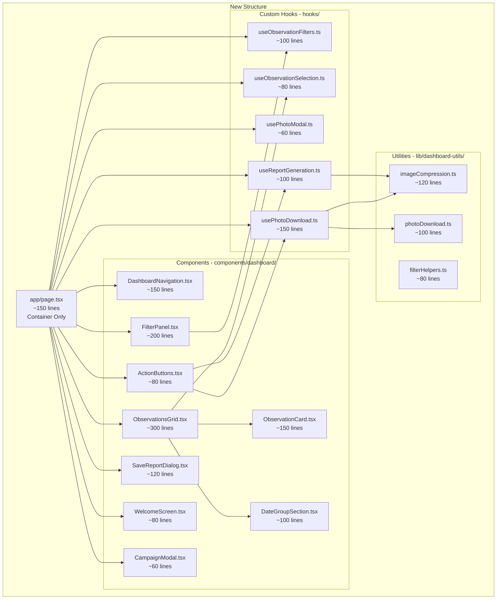

# Dashboard Refactoring Plan - app/page.tsx (1918 lines)

## 🚨 Current Problems

The current `app/page.tsx` file is a **monolithic 1918-line component** with the following issues:

1. **❌ Too Many Responsibilities** - Handles authentication, filtering, modals, photo operations, reporting, etc.
2. **❌ Difficult to Test** - All logic is tightly coupled in one component
3. **❌ Hard to Maintain** - Changes in one area can break unrelated features
4. **❌ Poor Performance** - Entire component re-renders on any state change
5. **❌ Code Duplication** - Filter logic repeated multiple times
6. **❌ Cognitive Overload** - 30+ state variables, 20+ functions

---

## 📊 Current Structure Analysis

### Current Method/Function Breakdown

```mermaid
graph TB
    subgraph "Current app/page.tsx - 1918 lines"
        Main[Main Component Home]

        subgraph "State - 30+ Variables"
            S1[user]
            S2[Zustand stores]
            S3[selectedObservations]
            S4[date filters: startDate, endDate]
            S5[search: searchQuery, showSearchSelector]
            S6[label filters: selectedLabels, showLabelSelector]
            S7[user/site filters]
            S8[modal states: photoModal, campaignModal, saveDialog]
            S9[report form: title, description, ersteller, etc.]
        end

        subgraph "Utility Functions"
            U1[t - translation helper]
        end

        subgraph "Action Handlers - 400+ lines"
            A1[handleGenerateReport]
            A2[compressImageForDownload - 110 lines]
            A3[handleDownloadPhotos - 120 lines]
        end

        subgraph "Filtering - 34 lines"
            F1[getFilteredObservations]
        end

        subgraph "Photo Modal - 38 lines"
            PM1[handleOpenPhotoModal]
            PM2[handleClosePhotoModal]
            PM3[handlePreviousPhoto]
            PM4[handleNextPhoto]
        end

        subgraph "Save Report - 72 lines"
            SR1[handleSaveReport]
        end

        subgraph "Delete - 59 lines"
            D1[handleDeleteObservation]
        end

        subgraph "Selection - 54 lines"
            SEL1[handleClearDateRange]
            SEL2[handleSelectAll]
        end

        subgraph "Date Range - 19 lines"
            DR1[getAvailableDateRange]
        end

        subgraph "Load More - 5 lines"
            LM1[handleLoadMore]
        end

        subgraph "URL Refresh - 48 lines"
            UR1[refreshSignedUrls]
        end

        subgraph "Data Fetching - 92 lines"
            DF1[fetchData useEffect]
            DF2[auth listener]
            DF3[extract users/sites useEffect]
        end

        subgraph "Render - 1070 lines!!!"
            R1[Navigation bar - 145 lines]
            R2[Welcome screen - 34 lines]
            R3[Date filter panel - 183 lines]
            R4[Search panel - 28 lines]
            R5[Label filter panel - 58 lines]
            R6[Observations grid - 560 lines]
            R7[Action buttons - 31 lines]
            R8[Photo modal - 53 lines]
            R9[Save dialog - 98 lines]
            R10[Claude chat - 12 lines]
            R11[Campaign modal - 37 lines]
        end

        Main --> S1 & S2 & S3 & S4 & S5 & S6 & S7 & S8 & S9
        Main --> U1
        Main --> A1 & A2 & A3
        Main --> F1
        Main --> PM1 & PM2 & PM3 & PM4
        Main --> SR1
        Main --> D1
        Main --> SEL1 & SEL2
        Main --> DR1
        Main --> LM1
        Main --> UR1
        Main --> DF1 & DF2 & DF3
        Main --> R1 & R2 & R3 & R4 & R5 & R6 & R7 & R8 & R9 & R10 & R11
    end
```



### Line Count by Section

| Section | Lines | % of Total |
|---------|-------|------------|
| **JSX Render** | ~1070 | 55.8% |
| **Action Handlers** | ~400 | 20.9% |
| **Data Fetching** | ~92 | 4.8% |
| **State Declarations** | ~60 | 3.1% |
| **Photo Modal Handlers** | ~38 | 2.0% |
| **Other Functions** | ~258 | 13.4% |

**🔥 Critical Issue:** Over 55% of the file is JSX, making it extremely hard to read and maintain!

---

## 🎯 Proposed Refactored Structure

### New Architecture Overview



---

## 📁 Detailed Refactoring Breakdown

### 1. Custom Hooks (lib/hooks/)

#### `useObservationFilters.ts` (~100 lines)
**Purpose:** Manage all filter state and logic

**Extracted from:**
- Lines 110-129 (filter state)
- Lines 410-443 (getFilteredObservations)
- Lines 621-626 (handleClearDateRange)
- Lines 676-694 (getAvailableDateRange)

**Interface:**
```typescript
export function useObservationFilters(observations: ObservationWithUrl[]) {
  return {
    // State
    startDate, setStartDate,
    endDate, setEndDate,
    searchQuery, setSearchQuery,
    selectedLabels, setSelectedLabels,
    selectedUserId, setSelectedUserId,
    selectedSiteId, setSelectedSiteId,
    showDateSelector, setShowDateSelector,
    showSearchSelector, setShowSearchSelector,
    showLabelSelector, setShowLabelSelector,

    // Computed
    filteredObservations: ObservationWithUrl[],
    availableUsers: {id: string, displayName: string}[],
    availableSites: {id: string, name: string}[],
    availableDateRange: {min: string, max: string},

    // Actions
    clearFilters: () => void,
    applyFilters: () => ObservationWithUrl[]
  }
}
```

---

#### `useObservationSelection.ts` (~80 lines)
**Purpose:** Handle observation selection logic

**Extracted from:**
- Lines 106-108 (selectedObservations state)
- Lines 628-674 (handleSelectAll)

**Interface:**
```typescript
export function useObservationSelection(
  filteredObservations: ObservationWithUrl[]
) {
  return {
    selectedObservations: Set<string>,
    toggleObservation: (id: string) => void,
    selectAll: () => void,
    clearSelection: () => void,
    isSelected: (id: string) => boolean,
    selectionCount: number
  }
}
```

---

#### `usePhotoModal.ts` (~60 lines)
**Purpose:** Photo modal state and navigation

**Extracted from:**
- Lines 131-133 (modal state)
- Lines 446-483 (modal handlers)

**Interface:**
```typescript
export function usePhotoModal(observations: ObservationWithUrl[]) {
  return {
    isOpen: boolean,
    selectedObservation: ObservationWithUrl | null,
    currentIndex: number,
    hasPrevious: boolean,
    hasNext: boolean,

    openModal: (observation: ObservationWithUrl) => void,
    closeModal: () => void,
    goToPrevious: () => void,
    goToNext: () => void
  }
}
```

---

#### `useReportGeneration.ts` (~100 lines)
**Purpose:** Report creation workflow

**Extracted from:**
- Lines 138-144 (report form state)
- Lines 163-168 (handleGenerateReport)
- Lines 486-557 (handleSaveReport)

**Interface:**
```typescript
export function useReportGeneration(
  selectedObservations: Set<string>
) {
  return {
    showDialog: boolean,
    reportForm: {
      title: string,
      description: string,
      ersteller: string,
      baustelle: string,
      date: string
    },
    isSaving: boolean,

    openDialog: () => void,
    closeDialog: () => void,
    updateField: (field: string, value: string) => void,
    saveReport: () => Promise<void>
  }
}
```

---

#### `usePhotoDownload.ts` (~150 lines)
**Purpose:** Photo compression and ZIP download

**Extracted from:**
- Lines 171-281 (compressImageForDownload)
- Lines 284-404 (handleDownloadPhotos)

**Interface:**
```typescript
export function usePhotoDownload() {
  return {
    isDownloading: boolean,
    downloadProgress: number,

    downloadPhotos: (
      observations: ObservationWithUrl[]
    ) => Promise<void>,

    compressImage: (
      blob: Blob,
      targetSizeKB: number
    ) => Promise<Blob>
  }
}
```

---

### 2. UI Components (components/dashboard/)

#### `DashboardNavigation.tsx` (~150 lines)
**Purpose:** Top navigation bar

**Extracted from:**
- Lines 882-1026 (navigation JSX)

**Props:**
```typescript
interface Props {
  user: User | null;
  showSearchSelector: boolean;
  showLabelSelector: boolean;
  showDateSelector: boolean;
  onToggleSearch: () => void;
  onToggleLabelFilter: () => void;
  onToggleDateFilter: () => void;
  onNavigateToReports: () => void;
  onNavigateToSettings: () => void;
}
```

---

#### `FilterPanel.tsx` (~200 lines)
**Purpose:** Combined filter UI (date, search, labels)

**Extracted from:**
- Lines 1080-1263 (date selector)
- Lines 1266-1293 (search input)
- Lines 1297-1353 (label filter)

**Props:**
```typescript
interface Props {
  filters: ReturnType<typeof useObservationFilters>;
  onSelectAll: () => void;
  onLoadMore: (type: 'week' | 'month') => void;
  isLoadingMore: boolean;
}
```

**Sub-components:**
- `DateRangeFilter.tsx`
- `SearchFilter.tsx`
- `LabelFilter.tsx`

---

#### `ObservationsGrid.tsx` (~300 lines)
**Purpose:** Main grid container with date grouping

**Extracted from:**
- Lines 1356-1568 (grid rendering logic)

**Props:**
```typescript
interface Props {
  observations: ObservationWithUrl[];
  groupedByDate: boolean;
  selectedObservations: Set<string>;
  onToggleSelection: (id: string) => void;
  onOpenPhoto: (obs: ObservationWithUrl) => void;
  onDelete: (id: string) => void;
}
```

---

#### `ObservationCard.tsx` (~150 lines)
**Purpose:** Single observation tile

**Extracted from:**
- Lines 1427-1559 (observation card JSX)

**Props:**
```typescript
interface Props {
  observation: ObservationWithUrl;
  isSelected: boolean;
  onToggleSelection: () => void;
  onOpenPhoto: () => void;
  onDelete: () => void;
  priority?: boolean; // For image loading
}
```

---

#### `DateGroupSection.tsx` (~100 lines)
**Purpose:** Collapsible date group with accordion

**Extracted from:**
- Lines 1408-1566 (date group accordion)

**Props:**
```typescript
interface Props {
  date: string;
  observations: ObservationWithUrl[];
  selectedObservations: Set<string>;
  onToggleSelection: (id: string) => void;
  onOpenPhoto: (obs: ObservationWithUrl) => void;
  onDelete: (id: string) => void;
}
```

---

#### `ActionButtons.tsx` (~80 lines)
**Purpose:** Fixed action buttons (bottom-right)

**Extracted from:**
- Lines 1677-1707 (action buttons JSX)

**Props:**
```typescript
interface Props {
  selectionCount: number;
  onClearSelection: () => void;
  onDownloadPhotos: () => void;
  onGenerateReport: () => void;
  isDownloading?: boolean;
}
```

---

#### `SaveReportDialog.tsx` (~120 lines)
**Purpose:** Report creation dialog

**Extracted from:**
- Lines 1764-1861 (save dialog JSX)

**Props:**
```typescript
interface Props {
  isOpen: boolean;
  reportForm: ReportForm;
  isSaving: boolean;
  onClose: () => void;
  onUpdateField: (field: string, value: string) => void;
  onSave: () => void;
}
```

---

#### `WelcomeScreen.tsx` (~80 lines)
**Purpose:** Landing page for unauthenticated users

**Extracted from:**
- Lines 1032-1066 (welcome message)

**Props:**
```typescript
interface Props {
  onShowCampaign?: () => void;
}
```

---

#### `CampaignModal.tsx` (~60 lines)
**Purpose:** Campaign image modal

**Extracted from:**
- Lines 1877-1915 (campaign modal JSX)

**Props:**
```typescript
interface Props {
  isOpen: boolean;
  onClose: () => void;
}
```

---

### 3. Utility Functions (lib/dashboard-utils/)

#### `imageCompression.ts` (~120 lines)
**Purpose:** Image compression logic

**Extracted from:**
- Lines 171-281 (compressImageForDownload)

**Exports:**
```typescript
export async function compressImageForDownload(
  blob: Blob,
  targetSizeKB: number = 50
): Promise<Blob>

export async function compressImageMultiPass(
  blob: Blob,
  passes: CompressionPass[]
): Promise<Blob>
```

---

#### `photoDownload.ts` (~100 lines)
**Purpose:** Photo fetching and ZIP creation

**Extracted from:**
- Lines 284-404 (handleDownloadPhotos core logic)

**Exports:**
```typescript
export async function downloadPhotosAsZip(
  observations: ObservationWithUrl[],
  onProgress?: (current: number, total: number) => void
): Promise<void>

export function createPhotoFilename(
  observation: ObservationWithUrl
): string
```

---

#### `filterHelpers.ts` (~80 lines)
**Purpose:** Additional filter utilities

**Exports:**
```typescript
export function extractUniqueUsers(
  observations: ObservationWithUrl[]
): {id: string, displayName: string}[]

export function extractUniqueSites(
  observations: ObservationWithUrl[]
): {id: string, name: string}[]

export function getDateRangeFromObservations(
  observations: ObservationWithUrl[]
): {min: string, max: string}
```

---

## 🏗️ New File Structure

```
app/
├── page.tsx (NEW - ~150 lines, container only)
│
components/
├── dashboard/
│   ├── DashboardNavigation.tsx (~150 lines)
│   ├── FilterPanel.tsx (~200 lines)
│   │   ├── DateRangeFilter.tsx (~80 lines)
│   │   ├── SearchFilter.tsx (~40 lines)
│   │   └── LabelFilter.tsx (~80 lines)
│   ├── ObservationsGrid.tsx (~300 lines)
│   ├── ObservationCard.tsx (~150 lines)
│   ├── DateGroupSection.tsx (~100 lines)
│   ├── ActionButtons.tsx (~80 lines)
│   ├── SaveReportDialog.tsx (~120 lines)
│   ├── WelcomeScreen.tsx (~80 lines)
│   └── CampaignModal.tsx (~60 lines)
│
lib/
├── hooks/
│   ├── useObservationFilters.ts (~100 lines)
│   ├── useObservationSelection.ts (~80 lines)
│   ├── usePhotoModal.ts (~60 lines)
│   ├── useReportGeneration.ts (~100 lines)
│   └── usePhotoDownload.ts (~150 lines)
│
├── dashboard-utils/
│   ├── imageCompression.ts (~120 lines)
│   ├── photoDownload.ts (~100 lines)
│   └── filterHelpers.ts (~80 lines)
```

---

## 📐 Refactored app/page.tsx (Target: ~150 lines)

```typescript
"use client";

import { useEffect } from "react";
import { createClient } from "@/lib/supabase/client";
import { useRouter } from "next/navigation";
import { useObservationsStore } from "@/lib/store/observations-store";
import { useLanguage } from "@/lib/translations";

// Custom hooks
import { useObservationFilters } from "@/lib/hooks/useObservationFilters";
import { useObservationSelection } from "@/lib/hooks/useObservationSelection";
import { usePhotoModal } from "@/lib/hooks/usePhotoModal";
import { useReportGeneration } from "@/lib/hooks/useReportGeneration";
import { usePhotoDownload } from "@/lib/hooks/usePhotoDownload";

// Components
import { DashboardNavigation } from "@/components/dashboard/DashboardNavigation";
import { FilterPanel } from "@/components/dashboard/FilterPanel";
import { ObservationsGrid } from "@/components/dashboard/ObservationsGrid";
import { ActionButtons } from "@/components/dashboard/ActionButtons";
import { PhotoModal } from "@/components/photo-modal";
import { SaveReportDialog } from "@/components/dashboard/SaveReportDialog";
import { WelcomeScreen } from "@/components/dashboard/WelcomeScreen";
import { CampaignModal } from "@/components/dashboard/CampaignModal";
import { ClaudeChat } from "@/components/claude-chat";
import { Footer } from "@/components/footer";

export default function Home() {
  const supabase = createClient();
  const router = useRouter();
  const { language } = useLanguage();

  // Zustand store
  const {
    observations,
    isLoading,
    isLoadingMore,
    hasMore,
    error,
    fetchInitialObservations,
    loadMoreObservations,
    siteLabels,
    fetchSiteLabels
  } = useObservationsStore();

  // Custom hooks
  const filters = useObservationFilters(observations);
  const selection = useObservationSelection(filters.filteredObservations);
  const photoModal = usePhotoModal(filters.filteredObservations);
  const reportGeneration = useReportGeneration(selection.selectedObservations);
  const photoDownload = usePhotoDownload();

  // Authentication state
  const [user, setUser] = useState(null);

  // Fetch initial data
  useEffect(() => {
    const fetchData = async () => {
      const { data: { user } } = await supabase.auth.getUser();
      if (!user) return;

      setUser(user);

      // Check onboarding
      const { data: profile } = await supabase
        .from('profiles')
        .select('onboarding_completed')
        .eq('id', user.id)
        .single();

      if (!profile?.onboarding_completed) {
        router.push("/onboarding");
        return;
      }

      await fetchInitialObservations(user.id);
    };

    fetchData();
  }, []);

  // Main render
  return (
    <main className="min-h-screen flex flex-col">
      {/* Navigation */}
      <DashboardNavigation
        user={user}
        showSearchSelector={filters.showSearchSelector}
        showLabelSelector={filters.showLabelSelector}
        showDateSelector={filters.showDateSelector}
        onToggleSearch={() => filters.setShowSearchSelector(!filters.showSearchSelector)}
        onToggleLabelFilter={() => filters.setShowLabelSelector(!filters.showLabelSelector)}
        onToggleDateFilter={() => filters.setShowDateSelector(!filters.showDateSelector)}
        onNavigateToReports={() => router.push('/reports')}
        onNavigateToSettings={() => router.push('/settings')}
      />

      {/* Main content */}
      <div className="flex-1">
        {!user ? (
          <WelcomeScreen />
        ) : isLoading ? (
          <LoadingSpinner />
        ) : (
          <>
            {/* Filters */}
            <FilterPanel
              filters={filters}
              onSelectAll={selection.selectAll}
              onLoadMore={loadMoreObservations}
              isLoadingMore={isLoadingMore}
            />

            {/* Observations grid */}
            <ObservationsGrid
              observations={filters.filteredObservations}
              selectedObservations={selection.selectedObservations}
              onToggleSelection={selection.toggleObservation}
              onOpenPhoto={photoModal.openModal}
              onDelete={handleDeleteObservation}
            />

            {/* Load more */}
            {hasMore && (
              <LoadMoreButtons onLoadMore={loadMoreObservations} />
            )}
          </>
        )}

        <Footer user={user} />
      </div>

      {/* Action buttons */}
      {selection.selectionCount > 0 && (
        <ActionButtons
          selectionCount={selection.selectionCount}
          onClearSelection={selection.clearSelection}
          onDownloadPhotos={() => photoDownload.downloadPhotos(
            observations.filter(obs => selection.isSelected(obs.id))
          )}
          onGenerateReport={reportGeneration.openDialog}
        />
      )}

      {/* Photo modal */}
      {photoModal.selectedObservation && (
        <PhotoModal
          isOpen={photoModal.isOpen}
          observation={photoModal.selectedObservation}
          onClose={photoModal.closeModal}
          onPrevious={photoModal.goToPrevious}
          onNext={photoModal.goToNext}
          hasPrevious={photoModal.hasPrevious}
          hasNext={photoModal.hasNext}
          siteLabels={siteLabels.get(photoModal.selectedObservation.site_id) || []}
        />
      )}

      {/* Save report dialog */}
      <SaveReportDialog
        isOpen={reportGeneration.showDialog}
        reportForm={reportGeneration.reportForm}
        isSaving={reportGeneration.isSaving}
        onClose={reportGeneration.closeDialog}
        onUpdateField={reportGeneration.updateField}
        onSave={reportGeneration.saveReport}
      />

      {/* Claude chat */}
      {user && (
        <ClaudeChat
          selectedObservations={selection.selectedObservations}
          allObservations={observations}
        />
      )}
    </main>
  );
}
```

**Result: ~150 lines (vs 1918 lines originally)**

---

## 🎯 Benefits of Refactoring

### Code Quality
- ✅ **Single Responsibility** - Each component/hook does one thing well
- ✅ **Testability** - Hooks and utilities can be unit tested easily
- ✅ **Readability** - Each file is 60-200 lines (human-readable)
- ✅ **Reusability** - Hooks can be reused in other parts of the app

### Performance
- ✅ **Better Memoization** - Smaller components re-render less frequently
- ✅ **Code Splitting** - Components can be lazy-loaded
- ✅ **Reduced Bundle Size** - Tree-shaking more effective

### Developer Experience
- ✅ **Faster Navigation** - Find code in seconds, not minutes
- ✅ **Easier Reviews** - PRs affect small, focused files
- ✅ **Less Merge Conflicts** - Changes isolated to specific files
- ✅ **Better IDE Performance** - Smaller files = faster intellisense

---

## 📋 Migration Steps

### Phase 1: Extract Utilities (Low Risk)
1. ✅ Create `lib/dashboard-utils/imageCompression.ts`
2. ✅ Create `lib/dashboard-utils/photoDownload.ts`
3. ✅ Create `lib/dashboard-utils/filterHelpers.ts`
4. ✅ Test utilities in isolation
5. ✅ Update imports in page.tsx

### Phase 2: Extract Hooks (Medium Risk)
1. ✅ Create `lib/hooks/useObservationFilters.ts`
2. ✅ Create `lib/hooks/useObservationSelection.ts`
3. ✅ Create `lib/hooks/usePhotoModal.ts`
4. ✅ Create `lib/hooks/useReportGeneration.ts`
5. ✅ Create `lib/hooks/usePhotoDownload.ts`
6. ✅ Test hooks with React Testing Library
7. ✅ Update page.tsx to use hooks

### Phase 3: Extract Components (High Risk)
1. ✅ Create simple components first:
   - WelcomeScreen.tsx
   - CampaignModal.tsx
   - ActionButtons.tsx
2. ✅ Create medium components:
   - DashboardNavigation.tsx
   - SaveReportDialog.tsx
   - ObservationCard.tsx
3. ✅ Create complex components:
   - FilterPanel.tsx (with sub-components)
   - ObservationsGrid.tsx
   - DateGroupSection.tsx
4. ✅ Test each component with Storybook
5. ✅ Update page.tsx to compose components

### Phase 4: Final Integration
1. ✅ Refactor page.tsx to container component
2. ✅ End-to-end testing
3. ✅ Performance testing
4. ✅ Deploy to staging
5. ✅ User acceptance testing
6. ✅ Deploy to production

---

## 🧪 Testing Strategy

### Unit Tests
```typescript
// lib/hooks/__tests__/useObservationFilters.test.ts
describe('useObservationFilters', () => {
  it('should filter by date range', () => {
    // Test date filtering
  });

  it('should filter by search query', () => {
    // Test search
  });

  it('should combine multiple filters', () => {
    // Test filter composition
  });
});
```

### Component Tests
```typescript
// components/dashboard/__tests__/ObservationCard.test.tsx
describe('ObservationCard', () => {
  it('should render observation details', () => {
    // Test rendering
  });

  it('should handle selection', () => {
    // Test click handlers
  });
});
```

### Integration Tests
```typescript
// app/__tests__/page.test.tsx
describe('Dashboard Page', () => {
  it('should load observations on mount', () => {
    // Test data loading
  });

  it('should filter observations', () => {
    // Test filtering workflow
  });

  it('should create report from selection', () => {
    // Test report generation
  });
});
```

---

## 📊 Comparison Table

| Metric | Before | After | Improvement |
|--------|--------|-------|-------------|
| **Main file size** | 1918 lines | ~150 lines | **92% reduction** |
| **Largest component** | 1918 lines | ~300 lines | **84% reduction** |
| **Number of files** | 1 | 22 | Better organization |
| **Testability** | Hard | Easy | Isolated units |
| **Reusability** | None | High | Hooks reusable |
| **Cognitive Load** | Very High | Low | Small files |
| **Performance** | Poor | Good | Optimized re-renders |

---

## 🚀 Recommended Approach

### Option A: Big Bang Refactoring (Not Recommended)
- Rewrite everything at once
- ❌ High risk of breaking changes
- ❌ Long feature freeze
- ✅ Clean slate

### Option B: Incremental Refactoring (Recommended)
- Refactor one section at a time
- ✅ Lower risk
- ✅ Continuous delivery
- ✅ Easy rollback
- ✅ Learn and adjust

### Suggested Timeline (Option B)
- **Week 1:** Extract utilities (Phase 1)
- **Week 2:** Extract 2-3 hooks (Phase 2.1)
- **Week 3:** Extract remaining hooks (Phase 2.2)
- **Week 4:** Extract simple components (Phase 3.1)
- **Week 5:** Extract medium components (Phase 3.2)
- **Week 6:** Extract complex components (Phase 3.3)
- **Week 7:** Final integration & testing (Phase 4)
- **Week 8:** Bug fixes & optimization

---

## 🎓 Key Principles

### 1. Component Composition
```typescript
// Bad: Monolithic
<Dashboard /> // 1918 lines

// Good: Composed
<Dashboard>
  <Navigation />
  <FilterPanel>
    <DateFilter />
    <SearchFilter />
    <LabelFilter />
  </FilterPanel>
  <ObservationsGrid>
    <DateGroupSection>
      <ObservationCard />
    </DateGroupSection>
  </ObservationsGrid>
</Dashboard>
```

### 2. Custom Hooks for Logic
```typescript
// Bad: Logic in component
const [startDate, setStartDate] = useState("");
const [endDate, setEndDate] = useState("");
// ... 100 more lines of filter logic

// Good: Logic in hook
const filters = useObservationFilters(observations);
// Clean, testable, reusable
```

### 3. Separation of Concerns
```typescript
// Bad: Mixed responsibilities
function Dashboard() {
  // Auth logic
  // Filter logic
  // Photo compression
  // Report generation
  // JSX rendering
}

// Good: Separated
function Dashboard() {
  const auth = useAuth();
  const filters = useObservationFilters();
  const photos = usePhotoDownload();
  const reports = useReportGeneration();

  return <UI />;
}
```

---

This refactoring will transform a monolithic 1918-line file into a well-structured, maintainable codebase with clear separation of concerns, improved testability, and better developer experience.
